# DexGraspNet-Main shadowhand to linkerhand l20

<figure>
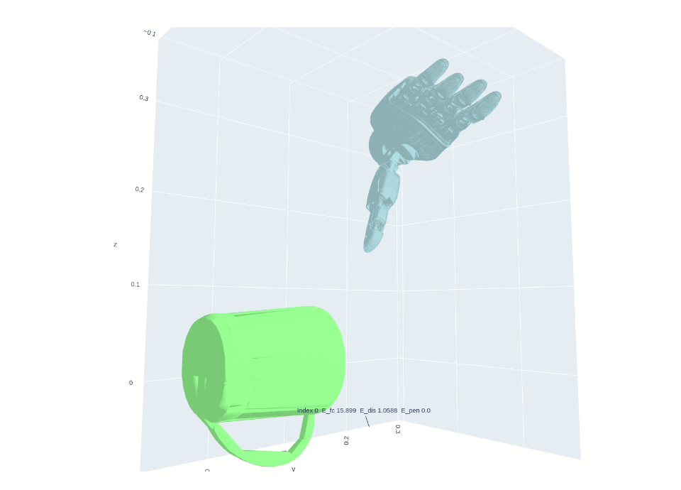
<figcaption
aria-hidden="true">Pastedimage20260510122737.png</figcaption>
</figure>

    python main.py --name l20_05101215 --object_code_list core-mug-8570d9a8d24cb0acbebd3c0c0c70fb03 --n_contact 4 --n_iter 10

    python tests/visualize_result.py   --object_code core-mug-8570d9a8d24cb0acbebd3c0c0c70fb03   --result_path ../data/experiments/l20_05101215/results

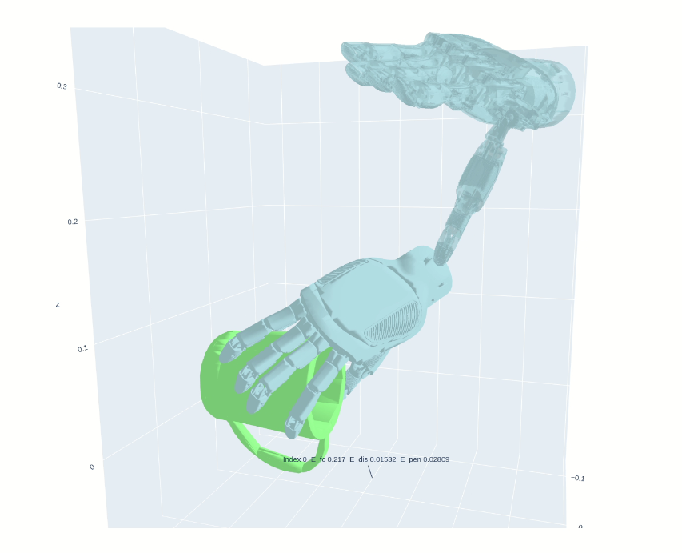
\## 运行检查shdowhand对比

    cd ~/gpufree-data/DexGraspNet-main/grasp_generation

    python main.py --name main05021t --object_code_list core-mug-8570d9a8d24cb0acbebd3c0c0c70fb03 --gpu "0"

    python tests/visualize_result.py \
      --object_code core-mug-8570d9a8d24cb0acbebd3c0c0c70fb03 \
      --result_path ../data/experiments/main05021t/results

<figure>
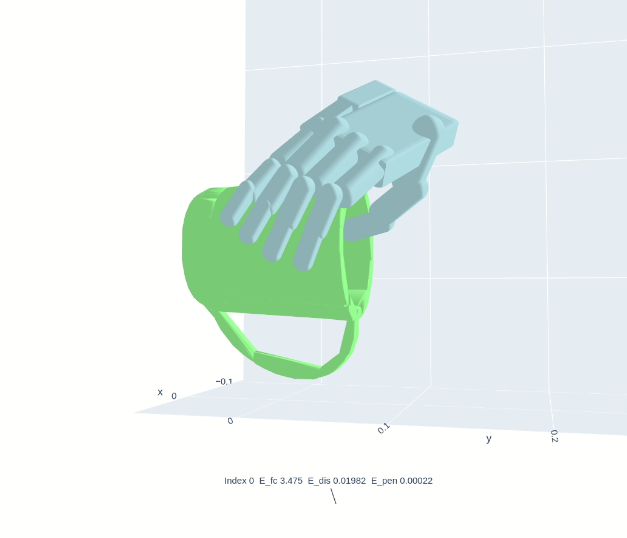
<figcaption
aria-hidden="true">Pastedimage20260502144709.png</figcaption>
</figure>

## 使用grasp\_ --all

    python generate_grasps.py --all

确保你处于 `grasp_generation` 根目录下，直接在终端敲：

**1. 一键可视化所有物体的最佳抓取（每个生成 1 个 HTML）：**

    python tests/visualize_result_all.py --all

**2. 一键可视化所有物体的前 3 种不同抓取姿势：**

    python tests/visualize_result_all.py --all --num_vis 3

可视化 .html 文件会位于data/l20_graspdata

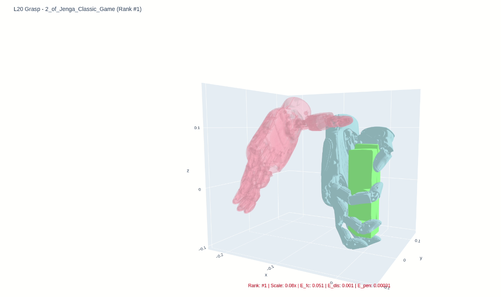
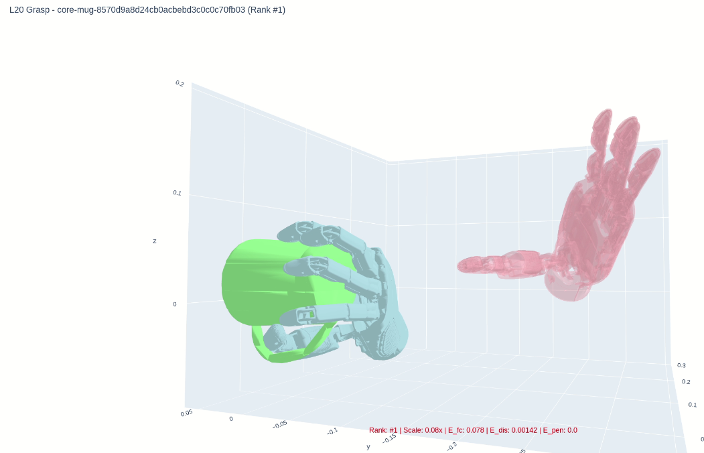
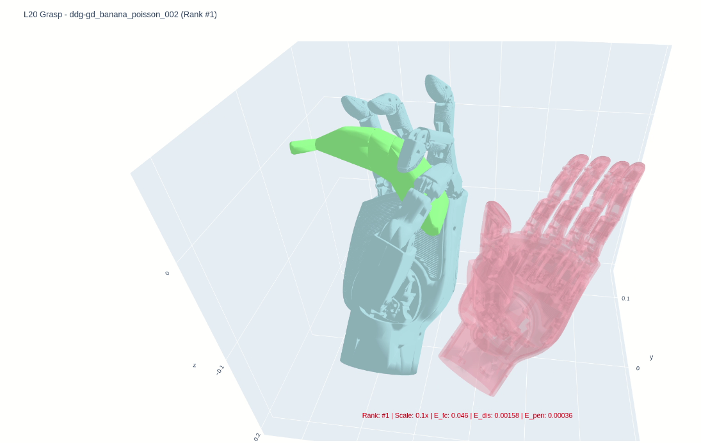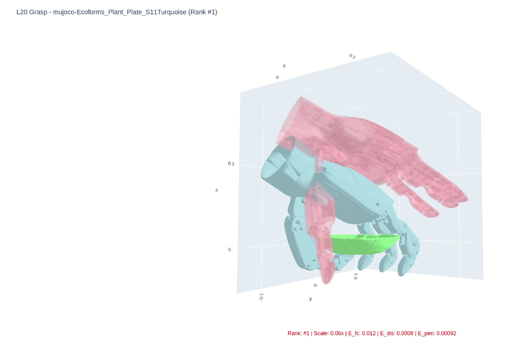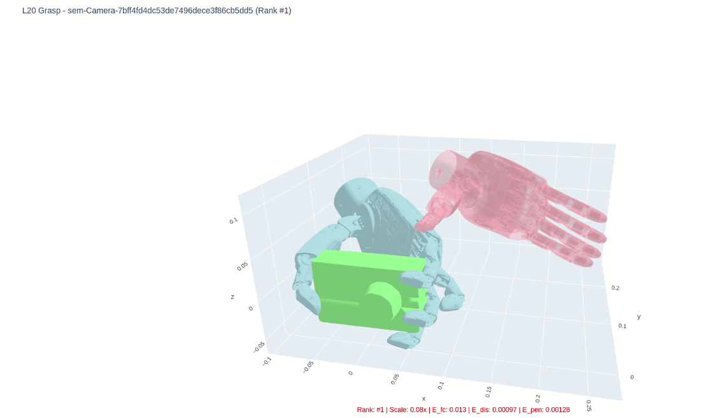

# 环境搭建

参考[environment.yml](https://github.com/brantleeee/DexGraspNet_LinkerHand_l20/blob/master/environment.yml "environment.yml")、[DexGraspNet_env_report_20260516_193632.log](https://github.com/brantleeee/DexGraspNet_LinkerHand_l20/blob/master/DexGraspNet_env_report_20260516_193632.log)
重点注意python版本、PyTorch版本、GCC版本

# 模型准备

### shadow hand模型可视化

<figure>
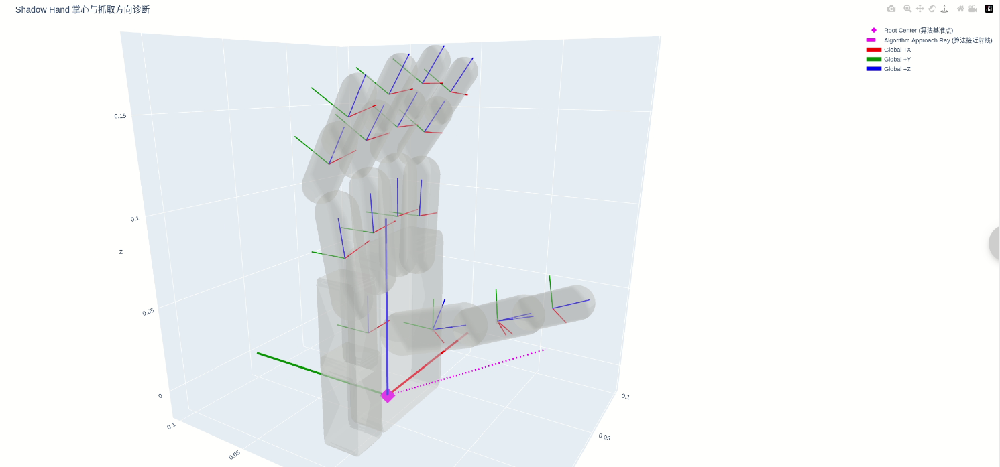
<figcaption
aria-hidden="true">Pastedimage20260509230521.png</figcaption>
</figure>

经过可视化校准，迁移有明显需要注意的

ShadowHand body frame == LinkerHand body frame
ShadowHand geom frame == LinkerHand geom frame
但是 ==mesh 零姿态语义不同==
LinkerHand L20 需要绕自身 Z 轴 -90° 才和 ShadowHand 掌心/四指方向一致
现在出现的是"物理外观对齐"和"坐标轴对齐"二选一的现象。这不是脚本错，而是说明 LinkerHand 的 mesh 语义帧和 body frame 语义帧不是 ShadowHand 那套定义。

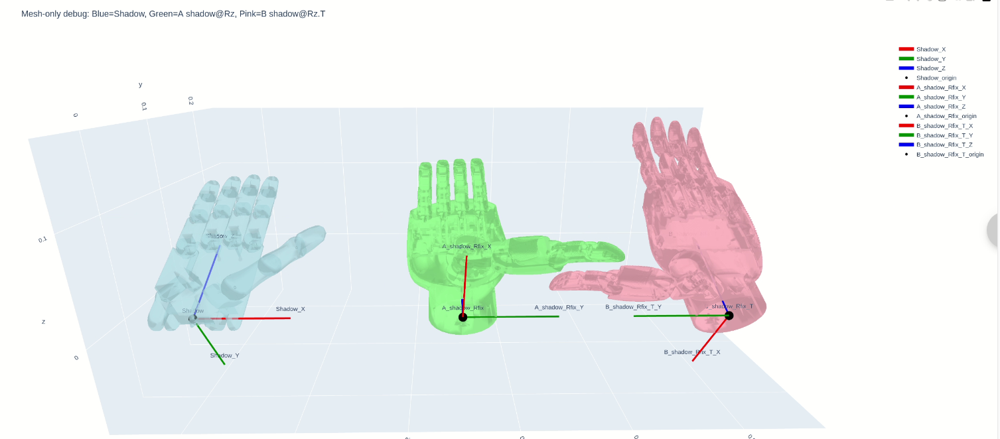
现在出现的是"物理外观对齐"和"坐标轴对齐"二选一的现象。这不是脚本错，而是说明 LinkerHand 的 mesh 语义帧和 body frame 语义帧不是 ShadowHand 那套定义。
\## 接触点和穿透点生成

    cd /root/DexGraspNet/grasp_generation

    python generate_l20_contacts_right_v1.py

    python generate_l20_armor_right_v2.py

    python check_contact_fk_l20_right.py

    python check_penetration_fk_l20_right.py

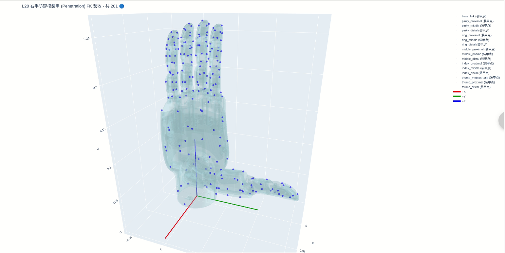
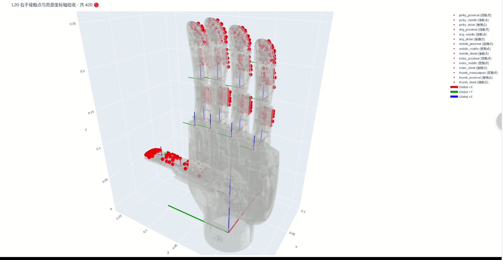
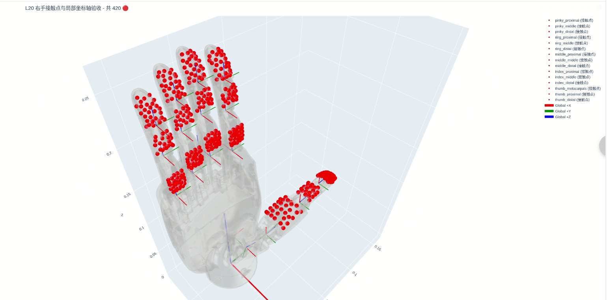
原shadowhand

    穿透点
    ✅ 统计完成！
    -> 包含点云的连杆总数 : 23 个
    -> 全局暴露面防穿模点总计: 41 个
    =================================================

    接触点
    ✅ 统计完成！
    -> 包含点云的连杆总数 : 19 个
    -> 全局暴露面防穿模点总计: 140 个
    =================================================

### 对比

#### shadow hand

<figure>

<figcaption
aria-hidden="true">Pastedimage20260509230521.png</figcaption>
</figure>

#### 修改后的linkerhand l20

<figure>
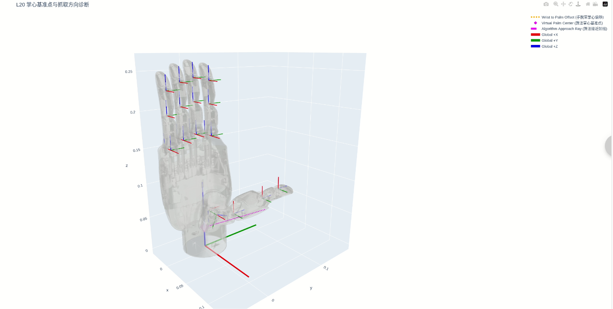
<figcaption
aria-hidden="true">Pastedimage20260510120119.png</figcaption>
</figure>
